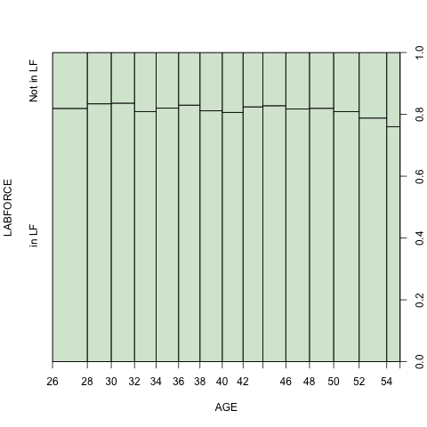
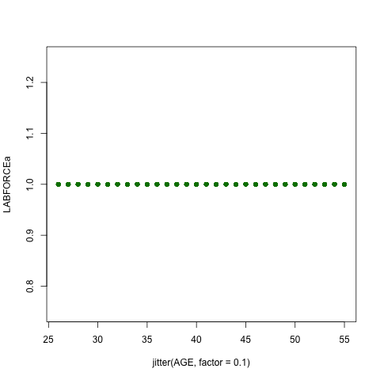

```{r include=FALSE}
knitr::opts_chunk$set(echo = FALSE)
setwd("~/CCNY/Econometrics/Homework/Draft Hwk Files")
load("acs2017_ny_data.RData")
attach(acs2017_ny)
detach()
```

```{r}
acs2017_ny$LABFORCE <- as.factor(acs2017_ny$LABFORCE)
levels(acs2017_ny$LABFORCE) <- c("NA","Not in LF","in LF")
acs2017_ny$MARST <- as.factor(acs2017_ny$MARST)
levels(acs2017_ny$MARST) <- c("married spouse present","married spouse absent","separated","divorced","widowed","never married")
```
### Data Check
As we are using the ACS Data to examine labor force participation, we double check we have the correct interpretation of "NA" as a label within the variable. Per the [Bureau of Labor Statistics](https://www.bls.gov/cps/definitions.htm#laborforce) website, "NA" should indicate that that particular respondent is too young and *is not* eligible to be counted in the labor force.
```{r}
acs2017_ny$age_bands <- cut(acs2017_ny$AGE,breaks=c(0,15,25,35,45,55,65,100))
table(acs2017_ny$age_bands,acs2017_ny$LABFORCE)
lftable <- table(acs2017_ny$age_bands,acs2017_ny$LABFORCE)
margin.table(lftable, 2)
proplfrow <- prop.table(lftable[ ,2:3], 1)
proplfrow
```
Here, we've broken the ages into groups, including an extra group to check whether our assumption about the "NA" label was correct. Only the age 0-15 returns any "NA" observations.

"Not in the Labor Force" are those respondents who are not participating in the labor force during the survey week. These people may be retirees or students.

In the second table, we can see the proportion of respondents within the various age brackets who are and who are not participating in the labor force. Other predictors that we think may give an indication of whether a person is participating in the labor force are their [family size](https://usa.ipums.org/usa-action/variables/FAMSIZE#description_section). This may have some confounding issues - heads of larger households ([householders](https://www.census.gov/programs-surveys/cps/technical-documentation/subject-definitions.html#householder) maybe be more likely to work while those who are not leading the family unit may not be as likely to participate in the workforce.

We also think rent may be a good indicator of whether a person is participation in the workforce. Lower rents may still be affordable to those who are retired, students or unable to actively participate in the labor force while higher rents would require someone to be working.

Finally, we thought examining whether someone is living below the poverty line would be a good indicator. The initial assumption is that those below the poverty line are less likely to be participating in the labor force, *however*, given the NYC minimum wage in 2017 was $11.00, it is conceivable that even those working may still be living below the [poverty line](https://www2.census.gov/programs-surveys/cps/tables/time-series/historical-poverty-thresholds/thresh17.xls). This is even more likely if the [NYC thresholds, p. 8](https://www1.nyc.gov/assets/opportunity/pdf/NYCgovPoverty2019_Appendix_B.pdf) are used instead of the US National guidelines.
```{r}
workers <- (acs2017_ny$LABFORCE =="in LF")
dat_workers <- subset(acs2017_ny,workers)
poorworkers <- subset(acs2017_ny, workers)$below_povertyline
table(poorworkers)
prop.table(table(poorworkers))
```
When we compare the groups, those in the workforce who live below the poverty line comprise only 6.29% of the workforce.

However, of those who live below the poverty line, 25.8% are active in the workforce. A step further would be to assess how many of those not in the labor force are discouraged workers.

```{r}
poverty <- subset(acs2017_ny, below_povertyline==1)$LABFORCE
povertya <- subset(acs2017_ny, below_povertyline==1)
table(poverty)
prop.table(table(poverty))
```

### Creating our first subset that we will be performing regressions on
```{r}
pick_use1 <- (acs2017_ny$AGE >25) & (acs2017_ny$AGE <= 55)
dat_use1 <- subset(acs2017_ny, pick_use1)
dat_use1$LABFORCE <- droplevels(dat_use1$LABFORCE) 
```

We would like to use FAMSIZE to see how family size affects a person's probabilities of being in the labor force. We decided to break up the family size column into three groups (# of family members): small (0-3), medium (4-6), large (7-29). 

Let's first take a bird's eye view of the acs2017 data to see how many of our three Family size groups are in the Labor Force.

Results: Looking at the overview table of our data we can see that a majority of people of all ages and family sizes participate in the labor force. This is to be expected as most people do need to make a living and bring in income to survive. But we see there is also a good proportion of those who are not in the labor force, which allows us to be able to do a regression analysis on the difference.
```{r}
acs2017_ny$SizeofFam <- cut(acs2017_ny$FAMSIZE,breaks=c(0,3,6,29))
table(acs2017_ny$LABFORCE,acs2017_ny$age_bands,acs2017_ny$SizeofFam)
```


Next, let's make separate columns in the acs2017 data for each of the three (3) family sizes similar to the (5) columns for education (educ_nohs, educ_hs, etc....). 

(Note: we have created an extra "Individual" column so that that can serve as the "dropped variable" when we are running our logit regressions)
```{r include=FALSE}
acs2017_ny$Individual <- ((acs2017_ny$FAMSIZE >= 1) & (acs2017_ny$FAMSIZE <= 1))
acs2017_ny$SmallFamily <- ((acs2017_ny$FAMSIZE >= 2) & (acs2017_ny$FAMSIZE <= 3))
acs2017_ny$MediumFamily <- ((acs2017_ny$FAMSIZE >= 4) & (acs2017_ny$FAMSIZE <= 6))
acs2017_ny$LargeFamily <- ((acs2017_ny$FAMSIZE >= 7) & (acs2017_ny$FAMSIZE <= 29))

dat_use1$Individual <- as.numeric((dat_use1$FAMSIZE >= 1) & (dat_use1$FAMSIZE <= 1))
dat_use1$SmallFamily <- as.numeric((dat_use1$FAMSIZE >= 2) & (dat_use1$FAMSIZE <= 3))
dat_use1$MediumFamily <- as.numeric((dat_use1$FAMSIZE >= 4) & (dat_use1$FAMSIZE <= 6))
dat_use1$LargeFamily <- as.numeric((dat_use1$FAMSIZE >= 7) & (dat_use1$FAMSIZE <= 29))

```

### Logit: Fam Size Only  
Next, let's run the logit regression to see how the family sizes affect whether someone is in the labor force or not.   

Expectation: We are expecting that one of the three (3) variables will drop off as that is necessary so that the variables can be compared to something. We were thinking that the larger the size of the family the less likely the labor participation rate would be because the more people in a household the less likely everyone in the household would need to work. The counter argument to that is that those with larger families have more mouths to feed and thus would increase their likelihood to be in the labor force. So it is hard to estimate which of the three (3) family sizes will show to have the largest effect on labor participation rates.  

Result: it appears that *small* families have the highest probability of being in the labor force. Those in *medium* families have the second highest probability of being in the labor force and those with *large* families have the lowest probabilities of being in the labor force. All of these coefficients used an Individual as the basis for comparison.
```{r}
model_logit2 <- glm(LABFORCE ~ SmallFamily + MediumFamily + LargeFamily + Individual,
            family = binomial, data = dat_use1)
summary(model_logit2)
```

### Logit: All Variables  
Next, let's add in all the other variables to see how that affects our probabilities.

Result: Small families continue to show the highest probability of labor force participation. Followed by medium families. Last is large families. All three family sizes are statistically significant at the 0.05 level. We note that adding the variables of AGE and gender increase the probabilities of labor force participation of the three family variables.

```{r}
model_logit3 <- glm(LABFORCE ~ AGE + female + SmallFamily + MediumFamily + LargeFamily + Individual,
            family = binomial, data = dat_use1)
summary(model_logit3)

#Predictions - Logit: All Variables
attach(dat_use1)
NNobs <- length(dat_use1$LABFORCE)
set.seed(12345)
graph_obs <- (runif(NNobs) < 0.5)
pred_graph <-subset(dat_use1, graph_obs)
# plot(LABFORCE ~ AGE, pch = 1, col = rgb(0, 0.5, 0, alpha = 0.2), ylim = c(0,1), xlim = c(0,1), data = pred_graph)
predict1 <- data.frame((AGE >= 25) & (AGE <= 55), female = 0, SmallFamily = 0, Individual = 0, MediumFamily = 0, LargeFamily = 1)
dat_use1$yhata <- predict(model_logit3, predict1, type = "response")
table(dat_use1$yhata)
pred_model_logit3 <- (dat_use1$yhata > 0.80)
table(pred = pred_model_logit3, true = dat_use1$LABFORCE)
prop.table(table(pred = pred_model_logit3, true = dat_use1$LABFORCE))
predacc1 <- sum(0.07214252+0.52641623)
predacc1
detach()
```

### Logit: All Variables (Interactions)  
Result: The interactions of family size and being female appear to be negative. This is telling us that being female negative impacts the probabilities of being in the labor force whatever the person's family size. Similarly, women's probability of participation in the labor force only changes 0.09% with every year increase in age.
```{r}
model_logit4 <- glm(LABFORCE ~ AGE + female + MediumFamily + LargeFamily + SmallFamily + I(MediumFamily*female) + I(LargeFamily*female) + I(SmallFamily*female) + I(female*AGE),
            family = binomial, data = dat_use1)
summary(model_logit4)

#Predictions - Logit: All Variables (Interactions)
attach(dat_use1)
# plot(LABFORCE ~ AGE, pch = 1, col = rgb(0, 0.5, 0, alpha = 0.2), ylim = c(0,1), xlim = c(0,1), data = pred_graph)
predict2 <- data.frame((AGE >= 25) & (AGE <= 55), female = 0, SmallFamily = 0, Individual = 0, MediumFamily = 0, LargeFamily = 1)
dat_use1$yhata <- predict(model_logit4, predict2, type = "response")
table(dat_use1$yhata)
pred_model_logit1 <- (dat_use1$yhata > 0.88)
table(pred = pred_model_logit1, true = dat_use1$LABFORCE)
prop.table(table(pred = pred_model_logit1, true = dat_use1$LABFORCE))
predacc2 <- sum(0.09349436+0.42802429)
predacc2
detach()
```

```{r eval=FALSE, include=FALSE}
# quartz(title="Labor Force Participation") # creates a quartz window with title
attach(dat_use1)
dat_use1$LABFORCEa <- as.factor(dat_use1$LABFORCE)
levels(dat_use1$LABFORCEa) <- c("0", "1")
detach()
```
```{r eval=FALSE, include=FALSE}
# left in for review later; not part of submission
# https://sites.google.com/site/daishizuka/toolkits/plotting-logistic-regression-in-r
attach(dat_use1)
plot(AGE,LABFORCE,xlab="Age",ylab="Probability of LF Participation", ylim = c(0,1))
g=glm(LABFORCE ~ AGE + female + MediumFamily + LargeFamily + SmallFamily,
            family = binomial, data = dat_use1) 
curve(predict(g, data.frame(AGE=x, female=x, MediumFamily=x, LargeFamily=x, SmallFamily=x),type="resp"))
detach()
```


# Probit: All Variables
Result: The Probit estimation also shows small familes with the highest probabilities to being in the labor force, which is similar to the logit models, albeit with a smaller probability than logit. The medium-size and large-size families follow just like in the logit models.

```{r}
model_probit1 <- glm(LABFORCE ~ AGE + female + SmallFamily + MediumFamily + LargeFamily + Individual,
            family = binomial (link = 'probit'), data = dat_use1)
summary(model_probit1)

attach(dat_use1)
png(filename="./probit.png")
plot(LABFORCE ~ AGE, pch = 1, col = rgb(0, 0.5, 0, alpha = 0.2), ylim = c(0,1), xlim = c(0,1), data = pred_graph)
dev.off
predict3 <- data.frame((AGE >= 25) & (AGE <= 55), female = 0, SmallFamily = 0, Individual = 0, MediumFamily = 0, LargeFamily = 1)
dat_use1$yhata <- predict(model_probit1, predict3, type = "response")
table(dat_use1$yhata)
pred_model_probit1 <- (dat_use1$yhata > 0.80)
table(pred = pred_model_probit1, true = dat_use1$LABFORCE)
prop.table(table(pred = pred_model_probit1, true = dat_use1$LABFORCE))
predacc3 <- sum(0.06579035+0.55349303)
predacc3
detach()
```

# Probit: All Variables (Interactions)
Result: The resulting probit regression on the same X and Y variables (along with the same interactions) are very similar to logit model where we see all the interactions between female and all three sizes of family have a negative probability but the probability is not as pronounced in the profit model as in the logit model.
```{r}
model_probit2 <- glm(LABFORCE ~ AGE + female + MediumFamily + LargeFamily + SmallFamily + I(MediumFamily*female) + I(LargeFamily*female) + I(SmallFamily*female) + I(female*AGE),
            family = binomial (link = 'probit'), data = dat_use1)
summary(model_probit2)

#Prediction - Probit: All Variables (Interactions)

attach(dat_use1)
plot(LABFORCE ~ AGE, pch = 1, col = rgb(0, 0.5, 0, alpha = 0.2), ylim = c(0,1), xlim = c(0,1), data = pred_graph)
predict4 <- data.frame((AGE >= 25) & (AGE <= 55), female = 0, SmallFamily = 0, Individual = 0, MediumFamily = 0, LargeFamily = 1)
dat_use1$yhata <- predict(model_probit2, predict4, type = "response")
table(dat_use1$yhata)
pred_model_probit2 <- (dat_use1$yhata > 0.88)
table(pred = pred_model_probit2, true = dat_use1$LABFORCE)
prop.table(table(pred = pred_model_probit2, true = dat_use1$LABFORCE))
predacc4 <- sum(0.09864549+0.40342964)
predacc4
detach()
```

# Comparing all the predictions
Result: Comparing the logit and the probit where we used *All Variables* we can see that both the logit and probit models predicted accurately ~60% of the time. And for the *All Variables (Interaction)* we can see that both models predicted ~51%. In the end, we are able to see what we learned from the lecture notes: that probit and logit are approximately the same; the differences are rather small.
```{r}
#Logit: All Variables
predacc1
#Probit: All Variables
predacc3
#Logit: All Variables (Interaction)
predacc2
#Probit: All Variables (Interaction)
predacc4
```
### OLS Regression
We setup an OLS regression, regressing Labor Force Participation on Age, Gender and family. The slope coefficients are all quite small, though statistically significant. Each of the factors have a statistically significant relationship on labor force participation but in reality, likely little influence.
```{r}
dat_use1$LABFORCEa <- as.numeric(dat_use1$LABFORCE)
olslabforce <- lm(LABFORCEa ~ AGE + female + SmallFamily + MediumFamily + LargeFamily, data = dat_use1)
summary(olslabforce)
```
```{r}
attach(dat_use1)
NNobs <- length(INCWAGE)
set.seed(12345)
graph_obs <- (runif(NNobs) < 0.5)
predols <-subset(dat_use1, graph_obs)
detach()
```
```{r}
png(filename="./olsplot.png")
plot(LABFORCEa ~ jitter(AGE, factor = 0.1), pch = 16, col = rgb(0, 0.5, 0, alpha = 0.2), ylim = c(0.75,1.25), data = predols)
olspredict <- data.frame(AGE = 25:55, female = 1, SmallFamily = 0, LargeFamily = 1, MediumFamily = 0)
olspredict$yhat <- predict(olslabforce, newdata = olspredict)
lines(yhat ~ AGE, data = olspredict)
dev.off()
```
  

### Bibliography
Accessed: 11/09/2020 https://www.census.gov/programs-surveys/cps/technical-documentation/subject-definitions.html#householder

https://www.bls.gov/cps/definitions.htm#laborforce

https://usa.ipums.org/usa-action/variables/FAMSIZE#description_section